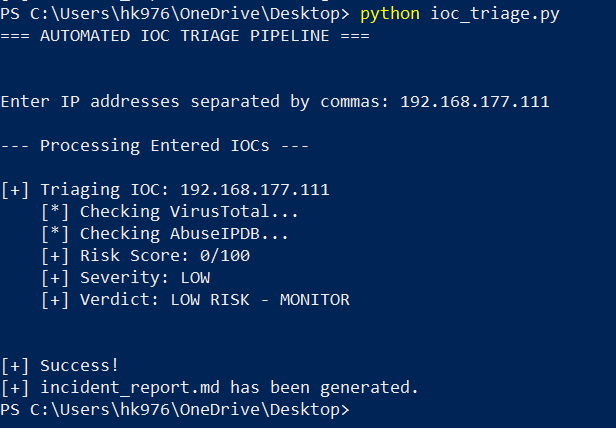
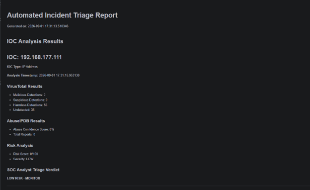

# Automated IOC Triage & Enrichment Pipeline


## Project Overview

The Automated IOC Triage & Enrichment Pipeline is a Python-based cybersecurity project designed to automate the initial investigation of suspicious Indicators of Compromise (IOCs).

Instead of manually checking multiple threat intelligence platforms, the tool automatically analyzes suspicious IP addresses using external threat intelligence APIs and generates a structured incident triage report.

This project simulates a basic SOC Analyst Level 1 automated triage workflow.

---

## Project Objectives

The main objectives of this project are:

* Automate IOC investigation.
* Reduce manual SOC analyst triage time.
* Enrich suspicious IP addresses with threat intelligence.
* Check IP reputation using multiple threat intelligence sources.
* Calculate and classify security risk.
* Generate an automated incident report.

---

## Features

* Accepts multiple IP addresses as input.
* Checks IP reputation using VirusTotal.
* Checks abuse reputation using AbuseIPDB.
* Calculates a risk score for analyzed IOCs.
* Classifies IOC severity levels.
* Generates an automated incident report.
* Supports structured project organization.
* Uses environment variables to protect API keys.

---

## Project Architecture

```text
User Input / Security Logs
            │
            ▼
      IOC Extraction
            │
            ▼
    IOC Validation
            │
     ┌──────┴──────┐
     ▼             ▼
VirusTotal      AbuseIPDB
     │             │
     └──────┬──────┘
            ▼
     Risk Scoring Engine
            │
            ▼
    Severity Classification
            │
            ▼
   Incident Report Generator
```

---

## Technologies Used

* Python
* VirusTotal API
* AbuseIPDB API
* Requests Library
* Python Dotenv
* JSON
* Markdown

---

## Project Structure

```text
automated-ioc-triage-pipeline/
│
├── README.md
├── requirements.txt
├── .gitignore
├── .env.example
│
├── src/
│   ├── main.py
│   ├── virustotal.py
│   ├── abuseipdb.py
│   ├── risk_scoring.py
│   └── report_generator.py
│
├── data/
│   └── sample_iocs.txt
│
├── reports/
│   └── sample_incident_report.md
│
└── screenshots/
    ├── terminal_output.png
    └── incident_report.png
```

---

## API Configuration

This project uses API keys from VirusTotal and AbuseIPDB.

Create a `.env` file in the root directory of the project.

Example:

```env
VT_API_KEY=your_virustotal_api_key
ABUSEIPDB_API_KEY=your_abuseipdb_api_key
```

Important: Never upload your `.env` file or real API keys to GitHub.

The `.env` file is excluded using `.gitignore`.

---

## Installation

### 1. Clone the Repository

```bash
git clone https://github.com/hassankhan-34/automated-ioc-triage-pipeline.git
```

### 2. Navigate to the Project Directory

```bash
cd automated-ioc-triage-pipeline
```

### 3. Install Required Dependencies

```bash
pip install -r requirements.txt
```

### 4. Configure API Keys

Copy `.env.example` and create a new `.env` file.

Add your VirusTotal and AbuseIPDB API keys.

---

## Usage

Run the application from the project root directory:

```bash
python src/main.py
```

Enter one or multiple IP addresses when prompted.

Example:

```text
Enter IP addresses separated by commas:

8.8.8.8, 1.1.1.1, 185.220.101.5
```

The application will:

1. Validate the IP address.
2. Query VirusTotal.
3. Query AbuseIPDB.
4. Calculate the risk score.
5. Assign a severity level.
6. Generate an incident report.

---

## Example Workflow

```text
[+] IOC Received: 185.220.101.5

[+] Checking VirusTotal...

Malicious: 5
Suspicious: 2

[+] Checking AbuseIPDB...

Abuse Confidence Score: 90%
Total Reports: 150

[+] Calculating Risk Score...

Risk Score: 85/100
Severity: HIGH

[+] Incident report generated successfully.
```

---

## Generated Report

The generated incident report contains:

* IOC value
* IOC type
* VirusTotal results
* AbuseIPDB results
* Risk score
* Severity classification
* Timestamp of analysis
* SOC analyst triage verdict

Example:

```text
IOC: 185.220.101.5
IOC Type: IP Address

VirusTotal Malicious Detections: 5
VirusTotal Suspicious Detections: 2

AbuseIPDB Confidence Score: 90%
AbuseIPDB Reports: 150

Risk Score: 85/100
Severity: HIGH

Verdict: POTENTIALLY MALICIOUS
```

---

## SOC Analyst Skills Demonstrated

This project demonstrates practical SOC Analyst skills including:

* Indicator of Compromise (IOC) analysis
* Threat intelligence enrichment
* API integration
* Security automation
* Alert triage
* Risk scoring
* Incident reporting
* Python automation

---

## Future Improvements

Future versions of this project may include:

* Support for domain analysis.
* URL reputation analysis.
* File hash analysis.
* Automatic IOC extraction from security logs.
* HTML dashboard.
* SQLite database integration.
* Email alert notifications.
* SIEM integration.
* MITRE ATT&CK technique mapping.
* Automated IOC blocking through firewall APIs.

---

## Screenshots

### Terminal Output



### Generated Incident Report



---

## Disclaimer

This project is created for educational and cybersecurity learning purposes.

Only analyze IOCs, systems, networks, and security data that you are authorized to investigate.

---

## Author

**Hassan Khan**

BSIT Student | Cybersecurity Enthusiast | Future SOC Analyst

---

## Support

If you found this project useful, consider giving the repository a star.
